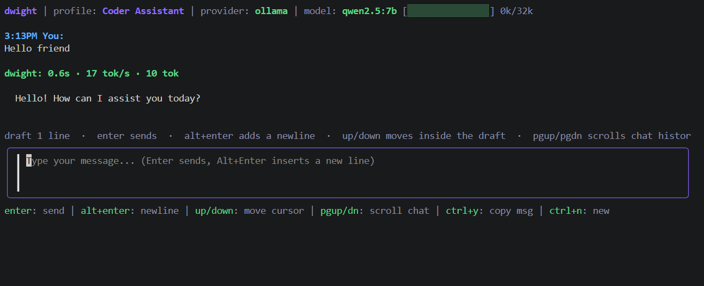

# dwight

Terminal AI chat client for Ollama and Gemini. `dwight` keeps model switching, saved conversations, and local file context in a lightweight terminal tool instead of a full browser workspace.



**Live demo:** [froesch.dev](https://froesch.dev)

## Install

Supported platforms: Linux and macOS.

Windows release binaries and installer entrypoints are shipped, but native Windows support is unverified.

Recommended:

```bash
curl -fsSL https://raw.githubusercontent.com/LFroesch/dwight/main/install.sh | bash
```

Windows:

```powershell
./install.ps1
```

```bat
install.cmd
```

Other options:

```bash
go install github.com/LFroesch/dwight@latest
make install
```

Run:

```bash
dwight
dwight --version
```

## Providers

Ollama works out of the box if you already have a local daemon running:

```bash
dwight
OLLAMA_HOST=http://localhost:11434 dwight
DWIGHT_MODEL=qwen2.5:7b dwight
```

Gemini works through an API key:

```bash
GEMINI_API_KEY=your_key dwight
```

`GOOGLE_API_KEY` is also accepted.

## Features

- Chat with Ollama or Gemini models
- Save multiple model profiles and switch between them
- Save, reopen, and export conversations
- Attach local files as context
- Browse available Ollama models and pull new ones
- Project-aware work context detection from the directory you launch it in

## Storage

User data lives under `~/.local/share/dwight/`.

| Path | Purpose |
|------|---------|
| `config.json` | app config |
| `.dwight-models.json` | saved model profiles |
| `settings.json` | user settings |
| `conversations/` | saved conversations |
| `exports/` | Markdown or JSON exports |

## Controls

| Key | Action |
|-----|--------|
| `enter` | Send message |
| `alt+enter` | Insert newline |
| `ctrl+s` | Save conversation |
| `ctrl+o` | Export conversation |
| `ctrl+n` | New conversation |
| `ctrl+l` | Clear chat |
| `ctrl+r` | Attach file |
| `ctrl+y` | Copy mode |
| `alt+,` / `alt+.` | Switch model profile |
| `?` | Help |
| `esc` | Back |

## Environment

| Variable | Purpose |
|----------|---------|
| `OLLAMA_HOST` | Ollama endpoint |
| `DWIGHT_MODEL` | default model for new profiles |
| `GEMINI_API_KEY` | Gemini API key |
| `GOOGLE_API_KEY` | alternate Gemini API key env var |

## License

[AGPL-3.0](LICENSE)
